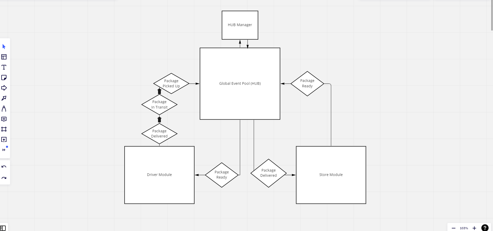

# CAPS

## LAB - 11

### Author : Hayden Cleaver

#### Running the App

- `node globalHub.js`

#### Tests

- Unit Tests: `npm run test`

#### UML

#### LAB 11 - Resubmit

- Not sure why my original code was breaking so hard; but I moved the emitters to a seperate hub file rather than the eventPool. Then I refactored it with some heavy influence from Alan Chelko and Ryan Gallaway's demonstration in today's review.

#### Lab 12 - socket.io

- Implemented web socket functionality and refactored code.
